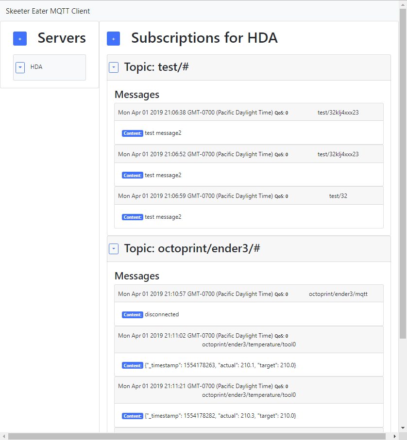

# skeeter-eater-mqtt-client

## Skeeter Eater - An MQTT Client web application

## From the author

The name of this app is Skeeter Eater. It is inspired by the open source [Mosquitto MQTT broker.](https://mosquitto.org/) I always thought that name was clever for incorporating the letters of MQTT in the name. An MQTT client “consumes” (eats!) an MQTT service, so I wanted a name that hinted at that. After a little bit of googling, I learned about the Crane Fly, also known as the Daddy Long Legs (not to be confused with the spider of the same name), Mosquito Hawk, and Mosquito Eater. Convert the word “Mosquito” into the vernacular version “Skeeter” that is used in some areas, and you have the “Skeeter Eater.” Although the fact that this insect eats mosquitos is actually a common misconception (They don’t!), I assure you that the Skeeter Eater MQTT Client does consume MQTT services.

This app is currently in the development phase. It has the ability to connect to an MQTT server and show configurable topics, barely, but it is missing a lot of work that would make it a "finished" product.

## Get Started

This project was created in Visual Studio Code using node.js and React.

The easiest way to get started is to

1.  Clone it.
2.  Open up the repo's root folder in Visual Studio Code.
3.  Open up a terminal and run `npm install`.
4.  After that finishes, run the command `npm run dev` in the same terminal. This simultaneously starts two web servers; one for the client app and one for the server app.
5.  Alternatively, instead of #4, you can open two terminals and have each run one of the following commands: `npm run client` and `npm run server`.

## More to come...
